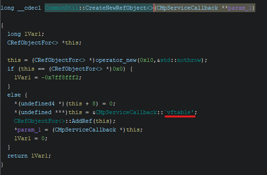

# 1.1 MpDefenderCoreService

## Overview

### General Information
| Type                  | Information                   |
|:----------------------|:------------------------------|
| File Size             | 1.35 MiB                      |
| Operating System      | NT Windows 10 x64 (AMD64) GUI |
| Executable Type       | PE (.exe)                     |
| Built-By              | Visual Studio 2022 (v17.6)    |
| Language              | ASM/C/C++                     |
| File Version (MS)     | 4.18                          |
| File Version (LS)     | 23110.3                       |
| Product Version (MS)  | 4.18                          |
| Product Version (LS)  | 23110.3                       |

### Used Tools
| Type      | Info                                              |
|:----------|:--------------------------------------------------|
| Compiler  | MASM(14.00.32595)                                 |
| Compiler  | Universal Tuple Compiler(19.00.32595)[C]          |
| Compiler  | Universal Tuple Compiler(19.00.32595)[C++]        |
| Compiler  | Universal Tuple Compiler(19.00.32595)[LTCG/C++]   |
| Tool      | CVTRES(14.00.32595)                               |
| Linker    | Microsoft linker(14.00.32595)                     |

### File Hashes
| Type      | Hash                                                              |
|:----------|:------------------------------------------------------------------|
| MD4       | 628cecce6ccb7aa876bdfc233b843e0e                                  |
| MD5       | 87cd7323bd51141f93d41303ee9bf37d                                  |
| SHA1      | d5f4923d713ff84dc515782aa66349b4dbbfd449                          |
| SHA224    | 707da5d138bb02a1ce35f0140c06355ebd4197dd77323bdd1f95d05f          |
| SHA256    | 57c2898168bd85133d0a3476252d3329c93a0eac0ff68587e25069a05aaf78d0  |
| SHA384    | 3724d4db39009cd94d8a900a5ca9dff118154576635d7515f23d9a36a2d296e621ba00a3015770e16cc6e11c417cf86c  |
| SHA512    | da8fae23ad0de8fc1a4a8517e97c36c76edfd7fec4d8ba40671d7a93fdd24bb7817dc857a146a1fbf6cf5b2f406d158b4557fe727414113d9179df64cb7f5ea2  |

### Entropy
**81%** Not Packed (6.50546)

| Offset	       | Size	          | Entropy | Status	 | Name                 |
|:-----------------|:-----------------|:--------|:-----------|:---------------------|
| 0000000000000000 | 0000000000001000 | 0.88408 | not packed | PE Header            |
| 0000000000001000 | 0000000000105000 | 6.46721 | not packed | Section(0)['.text']  |
| 0000000000106000 | 000000000003d000 | 5.56160 | not packed | Section(1)['.rdata'] |
| 0000000000143000 | 0000000000004000 | 3.70628 | not packed | Section(2)['.data']  |
| 0000000000147000 | 000000000000b000 | 5.83020 | not packed | Section(3)['.pdata'] |
| 0000000000152000 | 0000000000001000 | 2.86989 | not packed | Section(4)['.rsrc']  |
| 0000000000153000 | 0000000000002000 | 5.31355 | not packed | Section(5)['.reloc'] |
| 0000000000155000 | 00000000000055f0 | 7.76089 | packed	 | Overlay              |

## Decompile

### Locating `vftable`

`entry` → `__scrt_common_main_seh` → `wmain` → `HrExeMain` → `ServiceCrtMain` → `CommonUtil::CreateNewRefObject<>`



### Recovering `vftable`
`RecoverClassesFromRTTIScript.java`

```
RecoverClassesFromRTTIScript.java> Running...
Checking for missing RTTI information and undefined constructor/destructor functions and creating if possible to find entry point...
Recovering classes using RTTI...
Identified 138 classes to process and 300 class member functions to assign.
See Bookmark Manager for a list of functions by type.
Total number of constructors: 56
Total number of inlined constructors: 0
Total number of destructors: 12
Total number of inlined destructors: 0
Total number of virtual functions: 619
Total number of virtual functions that are deleting destructors: 0
Total number of virtual functions that are clone functions: 0
Total number of virtual functions that are vbase_destructors: 0
Total number of indetermined constructor/destructors: 226
Total fixed incorrect FID functions: 0
Total resolved functions that had multiple FID possiblities: 0
Total fixed functions that had incorrect data types due to incorrect FID: 0
RecoverClassesFromRTTIScript.java> Finished!
```

Before:
```cpp
result = (**(code **)(*this + 0x18))(this);
```

After:
```cpp
result = (*this->vftable->OnStartup)(this,(__uint64)pCVar1,argv);
``` 

---

MpDefenderCoreService.exe has been confirmed to most likely use **inline assembly**. Therefore, decompilation can no longer be trusted:
* Compilation optimization has been confirmed
* During analysis, the number of function parameters does not match
* Some functions have no parameters when called but receive parameters internally

---

### Identifying Defender Components

Below is the decompiled main service initialization routine code using ChatGPT. The code related to Asimov is most likely garbage (as can be seen in all functions):

```cpp
void InitializeSensors()
{
    for (int i = 0; i < 5; ++i)
    {
        const size_t stateOffset = i * 0x20;
        HRESULT hr = E_FAIL;

        // vftable-based factory (sensor / config manager creation)
        if (g_ConfigManagerFactories[i])
        {
            hr = reinterpret_cast<HRESULT>(
                g_ConfigManagerFactories[i]()
            );
        }

        // [WPP Branch - General ETW Trace]

        if (FAILED(hr))
        {
            // [Asimov Branch - Feedback Telemetry]

            // WatchDog / 1DS failure reporting
            MpWatchDog::Wd1dsMessage msg(
                L"MdCoreSvcSensorInitFailure"
            );

            msg.AddAttribute(
                L"ModuleName",
                gs_Modules[i]
            );

            msg.AddAttribute(
                L"HRESULT",
                hr
            );

            msg.Send();

            // [WPP Branch - Error-level ETW Trace]

            // Mark sensor as failed
            DAT_140143268[stateOffset] &= ~1;
        }
        else
        {
            // Mark sensor as initialized
            DAT_140143268[stateOffset] |= 1;
        }

        // Memory ordering / side-effect barrier
        MemoryBarrier();

        // Global stop / abort flag
        if (DAT_140149b10 > 0)
            break;

        // Service Control Manager heartbeat
        HrReportStatusToSCM(SERVICE_START_PENDING);
    }
}

```

The analysis with IDA revealed that it executes five initialization functions:
```cpp
.data:0000000140143250 ?gs_Modules@@3PAU_WATCHDOG_MODULE@@A
    // "WdConfigManager"
    MpWatchDog::WdConfigManagerInitialize(void)
    MpWatchDog::WdConfigManagerCleanup(void)

    // "WdAnomalyDetector"
    MpWatchDog::WdAnomalyDetectorInitialize(void)
    MpWatchDog::WdAnomalyDetectorCleanup(void)

    // "WdEcsSensor"
    MpWatchDog::WdEcsSensorInitialize(void)
    MpWatchDog::WdEcsSensorCleanup(void)

    // "1dsManager"
    MpWatchDog::Wd1dsInitialize(void)
    MpWatchDog::Wd1dsCleanup(void)

    // "MpWatchDogTimer"
    MpWatchDogTimerInitialize(void)
    MpWatchDogTimerCleanup(void)
```

`Windows Defender Configuration Manager`, `Windows Defender Anomaly Detector`, `Windows Defender ECS Sensor`, and a `Timer` are each initialized.

```
CMpServiceCallback::OnStartup
├── MpWatchDog::WdConfigManagerInitialize
├── MpWatchDog::WdAnomalyDetectorInitialize
├── MpWatchDog::WdEcsSensorInitialize
└── MpWatchDogTimerInitialize
```

