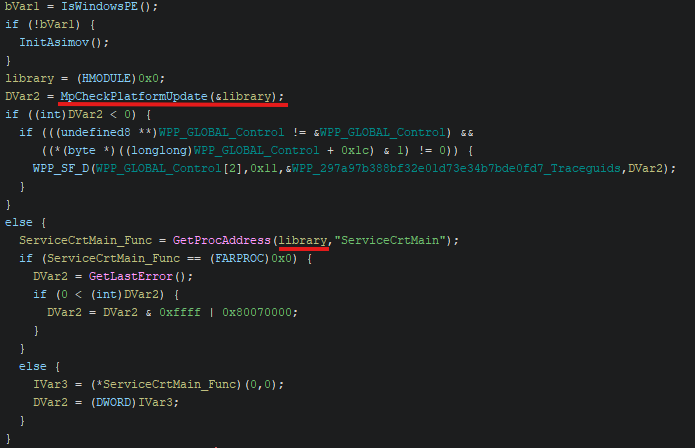
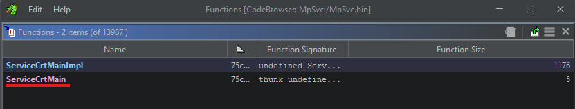
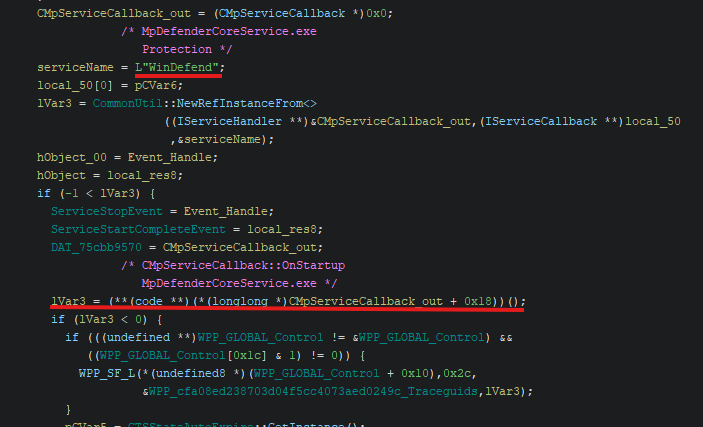

# 1.2 MsMpEng

## Overview

### General Information
| Type                  | Information                   |
|:----------------------|:------------------------------|
| File Size             | 130.46 KiB                    |
| Operating System      | NT Windows 10 x64 (AMD64) GUI |
| Executable Type       | PE (.exe)                     |
| Built-By              | Visual Studio 2022 (v17.6)    |
| Language              | ASM/C/C++                     |
| File Version (MS)     | 4.18                          |
| File Version (LS)     | 23110.3                       |
| Product Version (MS)  | 4.18                          |
| Product Version (LS)  | 23110.3                       |

### Used Tools
| Type      | Info                                              |
|:----------|:--------------------------------------------------|
| Compiler  | MASM(14.00.32595)                                 |
| Compiler  | Universal Tuple Compiler(19.00.32595)[C]          |
| Compiler  | Universal Tuple Compiler(19.00.32595)[C++]        |
| Compiler  | Universal Tuple Compiler(19.00.32595)[LTCG/C++]   |
| Tool      | CVTRES(14.00.32595)                               |
| Linker    | Microsoft linker(14.00.32595)                     |

### File Hashes
| Type      | Hash                                                              |
|:----------|:------------------------------------------------------------------|
| MD4       | 9abad86c5465937dc4ad18890da3c0df                                  |
| MD5       | 6eb45e2626f7d47cb0f491a1f2ef7e3e                                  |
| SHA1      | 8e51703b8b91287b0564c7684bc476e2d7888eff                          |
| SHA224    | 445bc6e4652ea0d8b034116a13a26dfc245bee9012c1035d3b2ab64b          |
| SHA256    | 7acd545afee1c8c9210b4bb6aa73d93b35d6aad2e330ec94bbcd2732dc8008c0  |
| SHA384    | 2db5c405be6966211b30b4f269841538cf21a62e035417f3057d0e3cd0ebc5558ca02b1746134c37d7bcfd185865ddb5  |
| SHA512    | ed8b60ddf2005077ff503602baf75d317bdb629a9107a3a2c283e2e9ad7f6bb9644666a3d713991b66f0e28ddc92c4d258c1a7f529511f01aeed8b87290eedc7  |

### Entropy
**73%** Not Packed (5.88515)

| Offset            | Size              | Entropy | Status      | Name                  |
|:------------------|:------------------|:--------|:-----------|:-----------------------|
| 0000000000000000  | 0000000000001000  | 0.88572 | not packed  | PE Header             |
| 0000000000001000  | 0000000000012000  | 6.30852 | not packed  | Section(0)['.text']   |
| 0000000000013000  | 0000000000006000  | 4.48051 | not packed  | Section(1)['.rdata']  |
| 0000000000019000  | 0000000000001000  | 3.28498 | not packed  | Section(2)['.data']   |
| 000000000001a000  | 0000000000002000  | 3.19555 | not packed  | Section(3)['.pdata']  |
| 000000000001c000  | 0000000000001000  | 3.59696 | not packed  | Section(4)['.rsrc']   |
| 000000000001d000  | 0000000000001000  | 0.81315 | not packed  | Section(5)['.reloc']  |
| 000000000001e000  | 00000000000029d8  | 7.51534 | packed      | Overlay               |

## Decompile

### Identifying `ServiceCrtMain`

`entry` → `__scrt_common_main_seh` → `wmain` → `HrExeMain`

In the function `HrExeMain`, ServiceCrtMain is executed as a function. It appears that this function is imported from a DLL loaded by `MpCheckPlatformUpdate`.



```
MpCheckPlatformUpdate
└── LoadMpSvcFrom
    └── CommonUtil::UtilLoadLibraryEx
```

Using CommonUtil::NewSprintfW, it stores `L"%ls\\mpsvc.dll"` in a wchar pointer string variable, loads it as the target DLL via CommonUtil::UtilLoadLibraryEx, and then saves the loaded function into the pointer of the 1st parameter:

```cpp
long LoadMpSvcFrom(HMODULE *hmodule,wchar_t *param_2,uint param_3) {
    uVar3 = (ulong)param_2;
    library_obj = (HMODULE)0x0;
    pWCHAR_0x0 = (wchar_t *)0x0;
    lVar1 = CommonUtil::NewSprintfW(
        &pWCHAR_0x0,
        L"%ls\\mpsvc.dll"
    );
    target_library = pWCHAR_0x0;

    ...

    lVar1 = CommonUtil::UtilLoadLibraryEx(
        &library_obj,
        target_library,
        0
    );
    hLibModule = library_obj;

    ...

    // LAB_14000890d:
    *hmodule = hLibModule;
    ...
}
```

```cpp
if ( v6 >= 0 )
{
    ProcAddress = GetProcAddress(hModule, "ServiceCrtMain");
    if ( ProcAddress )
    {
        v7 = ((__int64 (__fastcall *)(_QWORD, _QWORD))ProcAddress)(0, 0);
    }
    else
    {
        LastError = GetLastError();
        v7 = LastError;
        if ( LastError > 0 )
        v7 = (unsigned __int16)LastError | 0x80070000;
    }
}
```

Therefore, it is highly likely that `ServiceCrtMain` is located in `mpsvc.dll`.

### mpsvc.dll

`ServiceCrtMain` function was found added to the export list in mpsvc.dll:



It was confirmed that the WinDefend service is called, receives its CMpServiceCallback, and invokes `CMpServiceCallback + 0x18` in a vftable format:



Since `CMpServiceCallback` was identified as a **vftable in MpDefenderCoreService.exe**, analyzing it reveals code that calls a function at an offset of 0x18 in the vftable. Therefore, adding 0x18 to the vftable address 140108a28 gives `140108a28 + 0x18 = 140108a40`. This is the address of `CMpServiceCallback::OnStartup`.