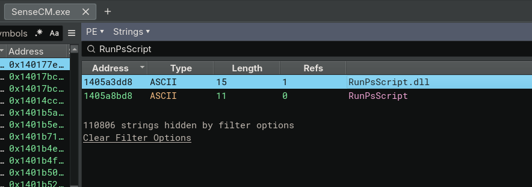
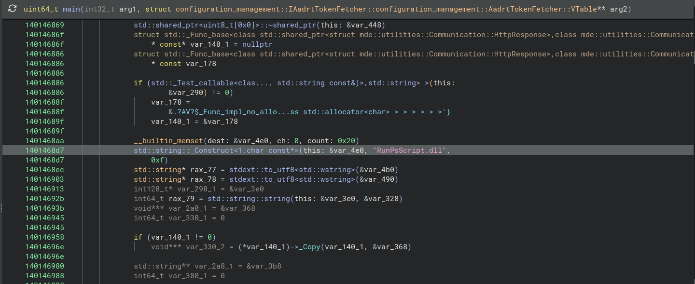
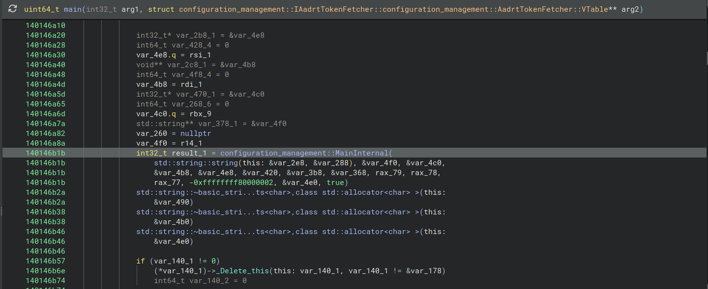
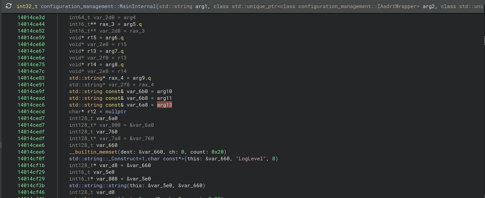
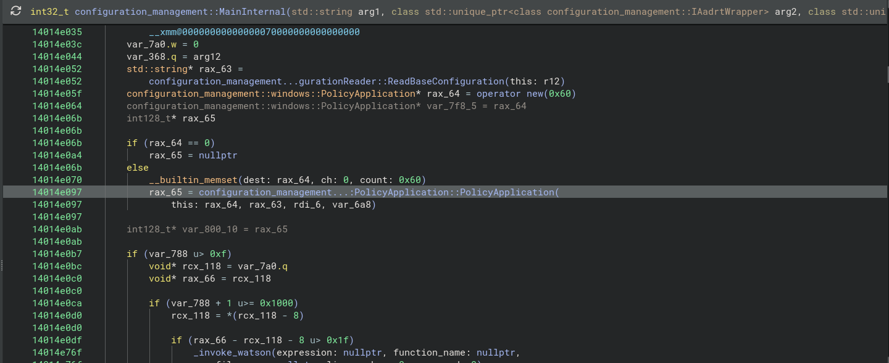

# 3.1 `SenseCM.exe → RunPsScript.dll`

## String Scan



## `main()`

### String Construct



### `main() → MainInternal()`



---

```cpp
uint64_t main(
    int32_t arg1,
    struct configuration_management::IAadrtTokenFetcher::configuration_management::AadrtTokenFetcher::VTable** arg2
) {
    // ...

    // String Construct
    std::string::_Construct<1,char const*>(this: &var_4e0, "RunPsScript.dll", 0xf)

    // ...

    // From main() to MainInternal()
    int32_t result_1 = configuration_management::MainInternal(
        std::string::string(this: &var_2e8, &var_288),
        &var_4f0,
        &var_4c0,
        &var_4b8,
        &var_4e8,
        &var_420,
        &var_3b8,
        &var_368,
        rax_79,
        rax_78,
        rax_77,
        -0xffffffff80000002,
        &var_4e0,                   // RunPsScript.dll
        true
    )

    // ...
}
```

## `MainInternal()`

### String Copy



### `MainInternal() → PolicyApplication()`



---

```cpp
int32_t configuration_management::MainInternal(
    std::string arg1,
    std::unique_ptr<configuration_management::IAadrtWrapper> arg2,
    std::unique_ptr<configuration_management::IJoinStateFetcher> arg3,
    std::unique_ptr<configuration_management::IAadrtTokenFetcher> arg4,
    std::unique_ptr<configuration_management::ILeviathanTokenProvider> arg5,
    std::function<configuration_management::AAdAccessLimitationStatus()> arg6,
    std::function<std::string()> arg7,
    std::function<
        std::shared_ptr<mde::utilities::Communication::HttpResponse>(
            mde::utilities::Communication::IHttpClient&,
            const std::string&,
            const std::string&,
            const std::string&,
            std::shared_ptr<std::map<std::string, std::string>>,
            std::shared_ptr<std::map<std::string, std::string>>
        )
    > arg8,
    std::string arg9,
    const std::string& arg10,
    const std::string& arg11,
    HKEY arg12,
    const std::string& arg13,
    bool arg14
) {
    // ...

    std::string const& var_6b0 = arg10
    std::string const& var_6b8 = arg11
    std::string const& var_6a8 = arg13      // RunPsScript.dll

    // ...

    rax_65 = configuration_management...:PolicyApplication::PolicyApplication(
        this: rax_64,
        rax_63,
        rdi_6,
        var_6a8     // RunPsScript.dll
    )

    // ...
}
```

## `PolicyApplication()`


---

```cpp
void configuration_management::windows::PolicyApplication::PolicyApplication(
    configuration_management::windows::PolicyApplication* this,
    std::string const& arg2,
    std::string const& arg3,
    std::string const& arg4
) {
    // 140177e2f    mov r14, r9
    std::string const& r14 = arg4       // RunPsScript.dll (r9)
    std::string const& rsi = arg3

    // ...

    *this = &configuration_management::windows::PolicyApplication::`vftable'

    // ...

    // 140177f21    mov r9, r14
    rbp = configuration_management::windows::ScriptRunner::ScriptRunner(
        this: rax_2,
        arg2,
        rsi,
        r14,        // RunPsScript.dll
        true
    )

    // ...
}
```

## `ScriptRunner()`


---

```cpp
void configuration_management::windows::ScriptRunner::ScriptRunner(
    configuration_management::windows::ScriptRunner* this, 
    std::string const& arg2,
    std::string const& arg3,
    std::string const& arg4,
    bool arg5
) {
    *this = &configuration_management::windows::ScriptRunner::`vftable'


    // 1401a4fc9    mov rbx, r9
    stdext::from_utf8<std::string>(this + 8)
    std::string::string(this: this + 0x28, arg4)

    void** var_1a8      // rbx
    void** lpLibFileName = stdext::from_utf8<std::string>(&var_1a8)

    if (lpLibFileName[3] u> 7)
        lpLibFileName = *lpLibFileName

    HMODULE rax_2 = LoadLibraryW(lpLibFileName)
    *(this + 0x58) = rax_2

    // ...

    *(this + 0x48) = GetProcAddress(hModule: *(this + 0x58), lpProcName: "RunPsScript")
}
```

---

### `SenseCM.exe` Compiler Optimization

When calling `configuration_management::windows::ScriptRunner::ScriptRunner` from `configuration_management::windows::PolicyApplication::PolicyApplication`, the following variables are passed as arguments:

1. `rax_2`
2. `arg2`
3. `rsi`
4. `r14`
5. `true`

However, inside `ScriptRunner()`, the DLL name cannot be identified in the decompiler.
Looking at the disassembly, it calls the `std::string::string()` function as follows:

```asm
lea rcx, [rsi+0x28]       <!-- (Load Effective Address of `rsi`'s 0x28 offset, i.e., this + 0x28) -->
mov rdx, rbx              <!-- (copy rbx to rdx) -->
call std::string::string  <!-- (call std::string::string) -->
```

According to the [x64 calling convention](https://learn.microsoft.com/en-us/cpp/build/x64-calling-convention?view=msvc-170#parameter-passing), when passing arguments, the calling convention order is as follows:


1. `rcx`
2. `rdx`
3. `r8`
4. `r9`
5. ...

Therefore, we can see that the 2nd argument, `arg4`, comes from rbx.
Looking at the disassembly, `rbx` is provided from `r9` by the following instruction:

```asm
0x1401a4fc9 mov rbx, r9
```

This confirms that `r9` is set before calling the current function:

```asm
mov byte [rsp+0x20 {var_58}], 0x1
mov r9, r14
mov r8, rsi
mov rdx, r12
mov rcx, rbx
call configuration_management::windows::ScriptRunner::ScriptRunner
```

Therefore, `arg4` is indeed the string `"RunPsScript.dll"`.

Looking at the assembly in more detail, `rax` is returned from `stdext::from_utf8<std::string>`.

```asm
cmp qword [rax+0x18], 0x7
jbe 0x1401a5019
```

In the decompiler view, this corresponds to the following conditional statement:

```cpp
if (lpLibFileName[3] u> 7)
```

In other words, the value represented as `lpLibFileName` in the decompiler originates from `rax`, which is the return value of `stdext::from_utf8<std::string>`.
This can also be verified in the `LoadLibraryW` function call:

```asm
mov rcx, rax
call qword [rel LoadLibraryW]
```

`rax` is passed as the first argument (`rcx`) to `LoadLibraryW`.

In summary, arg4 (`rbx`) is passed to `stdext::from_utf8<std::string>`, and that function returns the result in `rax`. Since that function is a string type conversion function, it converts the type of `const std::string&` `"RunPsScript.dll"` to a Wide String and calls `LoadLibraryW`. Therefore, expressed very simply, it is as follows:

```cpp
LoadLibraryW(L"RunPsScript.dll");
```

---

```asm
configuration_management...:PolicyApplication::PolicyApplication:
<!-- ... -->
mov     byte [rsp+0x20 {var_58}], 0x1
mov     r9, r14    <!-- Compiler Optimization -->
mov     r8, rsi
mov     rdx, r12
mov     rcx, rbx
call    configuration_management::windows::ScriptRunner::ScriptRunner
```

```asm
configuration_management::windows::ScriptRunner::ScriptRunner:
...
xor     rax, rsp {var_3b8}
mov     qword [rbp+0x270 {var_48}], rax
mov     rbx, r9        <!-- Compiler Optimization -->

...

mov     rdx, rbx
lea     rcx, [rbp+0x110 {var_1a8}]
call    stdext::from_utf8<std::string>
cmp     qword [rax+0x18], 0x7   <!-- if (lpLibFileName[3] u> 7) -->
jbe     0x1401a5019

mov     rcx, rax    <!-- 0x1401a5019 -->
call    qword [rel LoadLibraryW]    <!-- LoadLibraryW(lpLibFileName) -->
mov     qword [rsi+0x58], rax
test    rax, rax
jne     0x1401a5033


```

## `pRunPsScript()`

### `ScriptRunner::Run()`

```cpp
class stdext::result<struct configuration_management::ScriptResults> configuration_management::windows::ScriptRunner::Run(
    struct configuration_management::windows::ScriptRunner* this, 
    class std::shared_ptr<struct configuration_management::ScriptFlow> arg2,
    std::string const& arg3
) {
    // ...

    FARPROC pRunPsScript = this_2->pRunPsScript

    // ...

    int32_t rax_77 = pRunPsScript()

    // ...
}
```

```asm
lea     rdx, [rsp+0x5a0 {var_118}]

<!-- ... -->

mov     qword [rsp+0x40 {var_678_1}], r15  {0x0}
mov     qword [rsp+0x38 {var_680_1}], r15  {0x0}
mov     qword [rsp+0x30 {var_688_2}], rax
mov     qword [rsp+0x28 {var_690_2}], r8
mov     dword [rsp+0x20 {var_698}], edx
lea     r9, [rsp+0xd0 {var_5e8}]
lea     r8, [rsp+0x240 {var_478}]
mov     edx, dword [rsi+0x68]
lea     rcx, [rsp+0x60 {var_658}]
mov     rax, rbx
call    qword [rel __guard_dispatch_icall_fptr]
mov     r13d, eax
```

| Index | Argument      | Source            | Variable          | Size          |
|:------|:--------------|:------------------|:------------------|:--------------|
| 1     | `rcx`         | `[rsp+0x60]`      | `var_658`         | `uint64_t`    |
| 2     | `rdx`         | `[rsp+0x50]`      | `var_118`         | `uint64_t`    |
| 3     | `r8`          | `[rsp+0x240]`     | `var_478`         | `uint64_t`    |
| 4     | `r9`          | `[rsp+0xd0]`      | `var_5e8`         | `uint64_t`    |
| 5     | `[rsp+0x20]`  | `edx`             | `?`               | `uint32_t`    |
| 6     | `[rsp+0x28]`  | `r8`              | `var_5c8`         | `uint64_t`    |
| 7     | `[rsp+0x30]`  | `rax`             | `var_5a8`         | `uint64_t`    |
| 8     | `[rsp+0x38]`  | `r15`             | `{0x0}`           | `uint64_t`    |
| 9     | `[rsp+0x40]`  | `r15`             | `{0x0}`           | `uint64_t`    |

```cpp
uint32_t RunPsScript(
    uint64_t arg1,      // lea rcx, [rsp+0x60 {var_658}]
    uint64_t arg2,      // lea rdx, [rsp+0x5a0 {var_118}]
    uint64_t arg3,      // lea r8, [rsp+0x240 {var_478}]
    uint64_t arg4,      // lea r9, [rsp+0xd0 {var_5e8}]

    uint32_t arg5,      // mov dword [rsp+0x20 {var_698}], edx

    uint64_t arg6,      // mov qword [rsp+0x28 {var_690_2}], r8
    uint64_t arg7,      // mov qword [rsp+0x30 {var_688_2}], rax
    uint64_t arg8,      // mov qword [rsp+0x38 {var_680_1}], r15  {0x0}
    uint64_t arg9       // mov qword [rsp+0x40 {var_678_1}], r15  {0x0}
)
```

```cpp
uint32_t rax_74 = pRunPsScript(
    &arg1,
    this->__offset(0x68),
    &this->__offset(0x70),
    &this->__offset(0x90),
    arg5,
    arg6,
    arg7,
    NULL,
    NULL
)
```